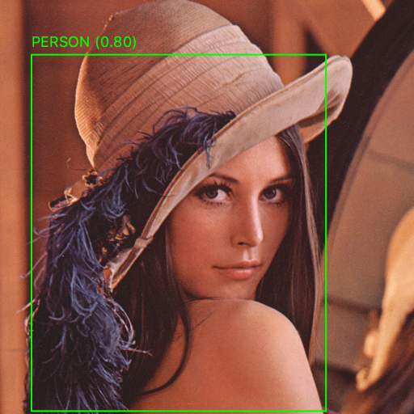

# YOLO Processing
An example implementation which shows how to use yolov2 from open cv within java / processing.

The project is based on the following C++ reference implementation:
https://docs.opencv.org/3.4.0/da/d9d/tutorial_dnn_yolo.html

### Setup
To run the example you have to install `opencv 3.4.1`. On a mac you can use `brew`:

```bash
brew install --build-from-source opencv
```

The java libraries are included in the project itself. Then you need the weights from the [darknet](https://pjreddie.com/darknet) project. Put it into the `data/darkent/` folder.

Finally just run the gradle build and run command:

```bash
gradle build
gradle run
```

And you should see the detected Lena:



### About
Thanks to
https://pjreddie.com/darknet